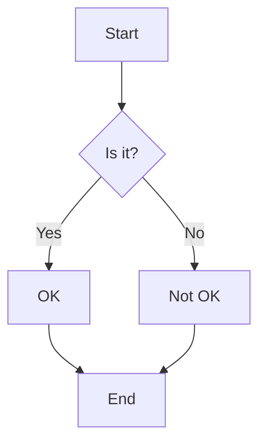
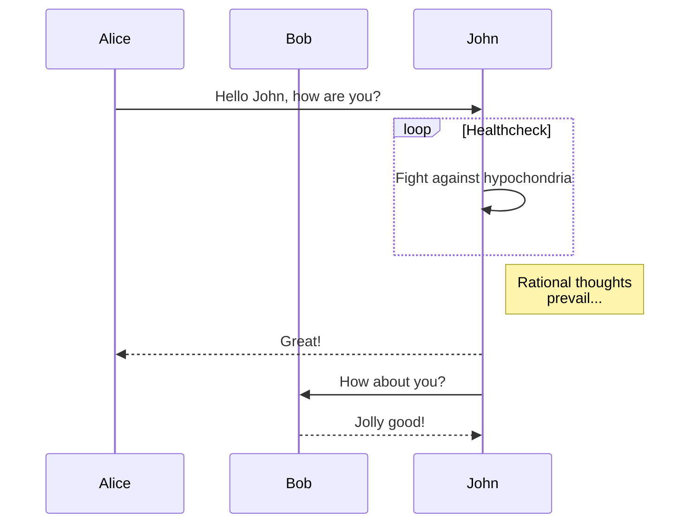
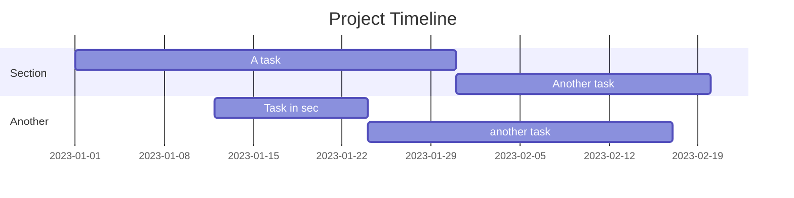
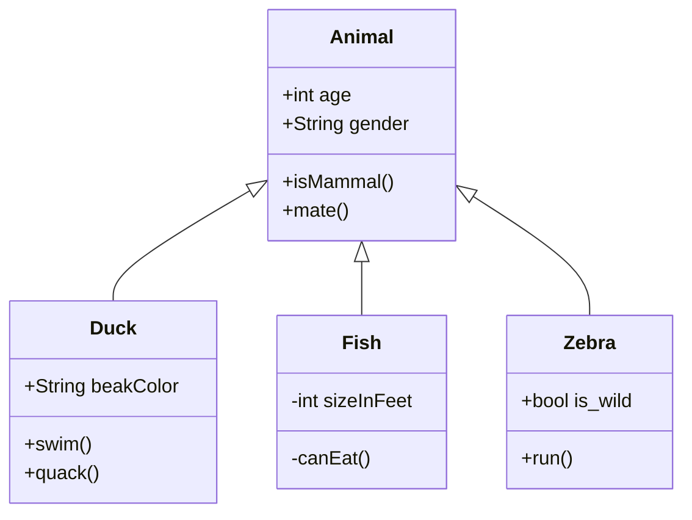

# Mermaid Plugin

## Overview
The Mermaid plugin integrates Mermaid.js into Docsify, allowing you to create and display diagrams and flowcharts directly from text definitions in your documentation.

## Features

- Supports multiple diagram types (flowcharts, sequence diagrams, Gantt charts, etc.)
- Live rendering in the browser
- Responsive and interactive
- Theme-aware styling
- Customizable appearance

## Installation

1. Include Mermaid.js and the Docsify Mermaid plugin:

```html
<!-- Mermaid.js -->
<script src="//cdn.jsdelivr.net/npm/mermaid/dist/mermaid.min.js"></script>
<!-- Docsify Mermaid plugin -->
<script src="//cdn.jsdelivr.net/npm/docsify-mermaid@latest"></script>
```

## Basic Usage

### Flowchart

````markdown

````

### Sequence Diagram

````markdown

````

## Configuration

```javascript
window.$docsify = {
  mermaid: {
    // Mermaid configuration
    theme: 'default',  // 'default', 'forest', 'dark', 'neutral'
    startOnLoad: true,
    // Plugin options
    mermaidOptions: {
      // Mermaid initialization options
      theme: 'default',
      themeVariables: {
        // Custom theme variables
        primaryColor: '#42b983',
        primaryTextColor: '#2c3e50',
        // ... other theme variables
      },
      // Other Mermaid config
      flowchart: {
        useMaxWidth: true,
        htmlLabels: true,
        curve: 'basis'
      },
      // ... other Mermaid options
    },
    // Callback after Mermaid is loaded
    onMermaidLoad: function(mermaid) {
      console.log('Mermaid loaded', mermaid);
    },
    // Error handling
    onError: function(error) {
      console.error('Mermaid error:', error);
    }
  }
};
```

## Diagram Types

### Gantt Chart

````markdown

````

### Class Diagram

````markdown

````

## Advanced Configuration

### Custom Theme

```javascript
mermaid: {
  theme: 'dark',
  mermaidOptions: {
    themeVariables: {
      primaryColor: '#1e1e1e',
      primaryTextColor: '#fff',
      primaryBorderColor: '#666',
      lineColor: '#F8B229',
      secondaryColor: '#006100',
      tertiaryColor: '#fff'
    }
  }
}
```

### Lazy Loading

```javascript
mermaid: {
  loadMermaid: false, // Disable auto-loading
  onMermaidLoad: function(mermaid) {
    // Load Mermaid manually
    mermaid.initialize({
      startOnLoad: true,
      theme: 'dark'
    });
    // Render all diagrams
    mermaid.init(undefined, '.language-mermaid');
  }
}
```

## Styling

### Custom CSS

```css
/* Container */
.mermaid {
  margin: 1.5em 0;
  text-align: center;
  background: #fff;
  border-radius: 4px;
  padding: 1em;
  box-shadow: 0 2px 4px rgba(0,0,0,0.1);
}

/* Dark theme support */
[data-theme="dark"] .mermaid {
  background: #2d2d2d;
}

/* Print styles */
@media print {
  .mermaid {
    background: white !important;
    page-break-inside: avoid;
  }
}
```

## Best Practices

1. **Keep diagrams simple** - Focus on key concepts
2. **Use meaningful IDs** - For better maintainability
3. **Test responsiveness** - Ensure diagrams look good on all devices
4. **Consider accessibility** - Add descriptions where needed
5. **Version control** - Keep diagram code in source control

## Troubleshooting

### Diagrams Not Rendering
1. Check browser console for errors
2. Verify Mermaid.js is loaded before the plugin
3. Ensure proper code fence syntax (```mermaid)

### Styling Issues
1. Check for CSS conflicts
2. Verify theme variables are correctly set
3. Ensure proper CSS specificity

## Browser Support

- Chrome (latest)
- Firefox (latest)
- Safari (latest)
- Edge (latest)

## Example

See the [official Mermaid documentation](https://mermaid-js.github.io/mermaid/#/) for more diagram types and examples.

## Last Updated
2025-06-28 01:00:00

*This file was last updated manually.*
