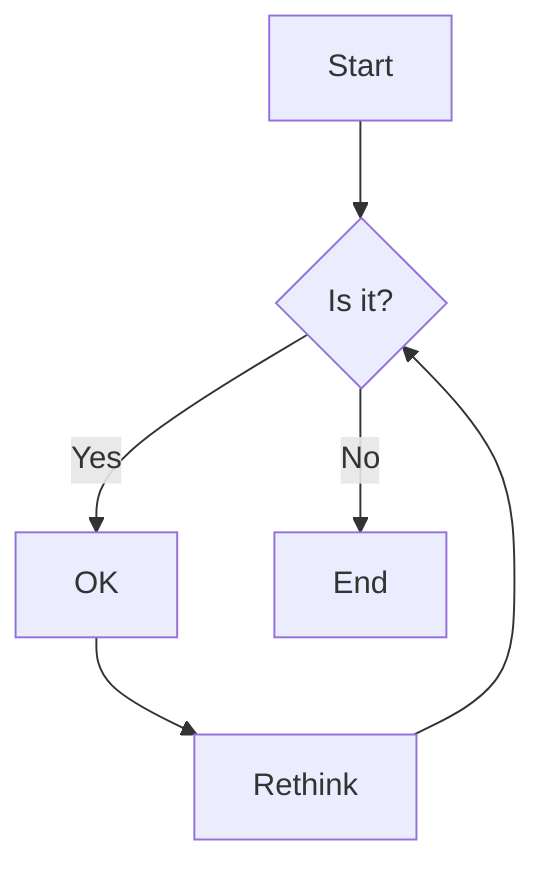
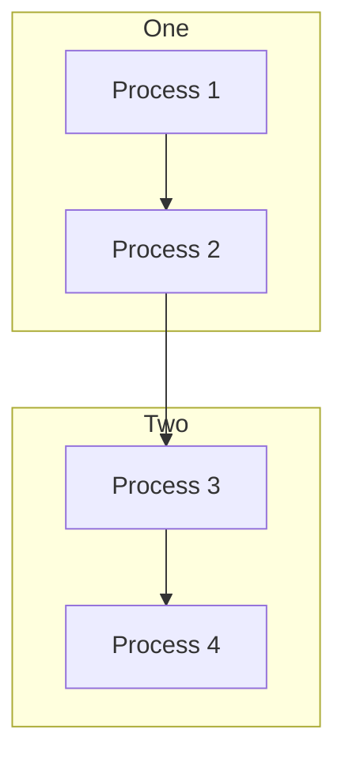
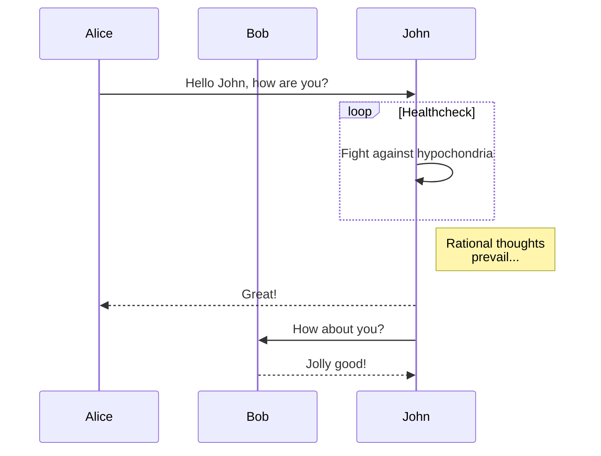
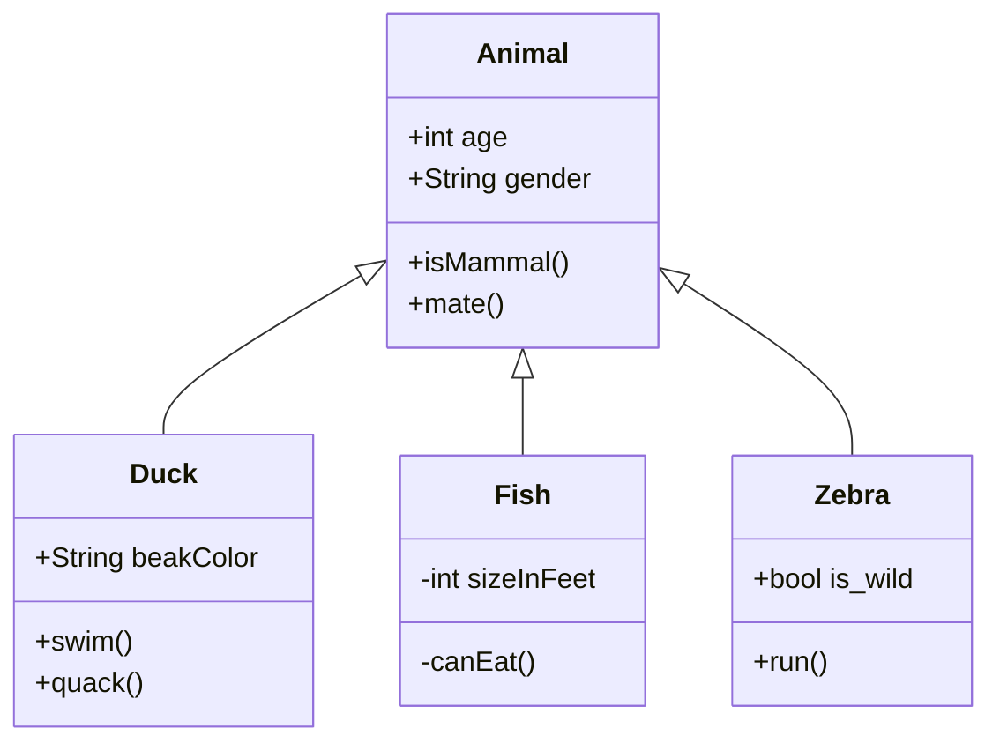
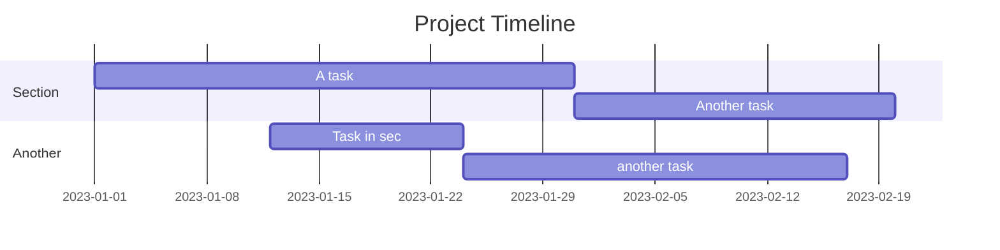
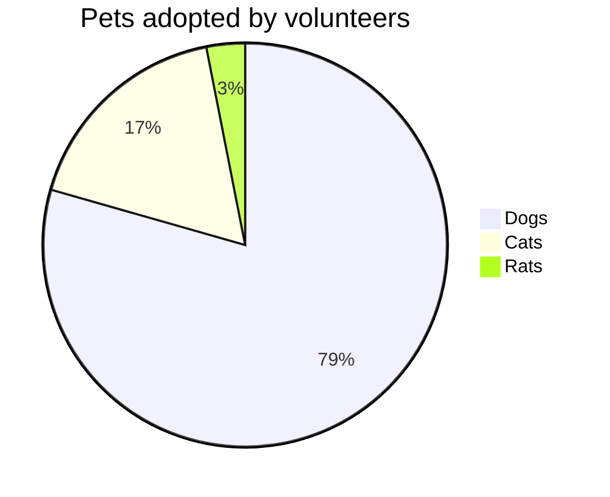

# Mermaid.js Integration - Complete Guide

## Introduction

Mermaid lets you create diagrams and visualizations using text and code. This guide shows how to use Mermaid with Docsify.

## Flowcharts

### Basic Flowchart

````markdown

````


### Flowchart with Subgraphs

````markdown

````


## Sequence Diagrams

### Basic Sequence

````markdown

````


## Class Diagrams

### Basic Class Diagram

````markdown

````


## Gantt Charts

### Project Timeline

````markdown

````


## Pie Charts

### Basic Pie Chart

````markdown

````


## Configuration

### Global Mermaid Configuration

```javascript
window.$docsify = {
  mermaid: {
    // Mermaid configuration options
    // See: https://mermaid-js.github.io/mermaid/#/Setup
    startOnLoad: true,
    theme: 'default',
    themeVariables: {
      primaryColor: '#f0f0f0',
      primaryTextColor: '#333',
      primaryBorderColor: '#7C0000',
      lineColor: '#F8B229',
      secondaryColor: '#006100',
      tertiaryColor: '#fff'
    },
    // Gantt configuration
    gantt: {
      titleTopMargin: 25,
      barHeight: 20,
      barGap: 4,
      topPadding: 50,
      leftPadding: 75,
      gridLineStartPadding: 35,
      fontSize: 11,
      fontFamily: '"Open-Sans", "sans-serif"',
      numberSectionStyles: 4,
      axisFormat: '%Y-%m-%d',
      // ...
    }
  }
};
```

## Advanced Features

### Using Themes

Mermaid supports several built-in themes:
- default
- forest
- dark
- neutral
- base

To set a theme:

```javascript
window.$docsify = {
  mermaid: {
    theme: 'dark'  // or 'default', 'forest', 'neutral', 'base'
  }
};
```

### Custom CSS

You can style Mermaid diagrams using CSS:

```css
/* Customize diagram colors */
.mermaid .label {
  color: #333;
}

/* Style flowchart nodes */
.mermaid .node rect,
.mermaid .node circle,
.mermaid .node ellipse,
.mermaid .node polygon {
  fill: #e0f7fa;
  stroke: #26c6da;
  stroke-width: 2px;
}

/* Style arrows */
.mermaid .arrowheadPath,
.mermaid .edgePath .path {
  stroke: #666;
  stroke-width: 1.5px;
}
```

## Best Practices

1. **Keep it Simple**
   - Break complex diagrams into smaller, focused ones
   - Use subgraphs to organize related elements

2. **Accessibility**
   - Add descriptive titles to all diagrams
   - Use sufficient color contrast
   - Consider adding alternative text descriptions

3. **Performance**
   - Avoid extremely large diagrams
   - Consider splitting very large sequence diagrams
   - Use the `data-config` attribute for complex configurations

## Troubleshooting

- **Diagrams not rendering?**
  - Check browser console for errors
  - Ensure Mermaid.js is properly loaded
  - Verify your syntax is correct

- **Styling issues?**
  - Check for CSS conflicts
  - Verify your theme settings
  - Ensure proper container sizing

---

For more information, visit the [Mermaid.js documentation](https://mermaid-js.github.io/mermaid/#/).
